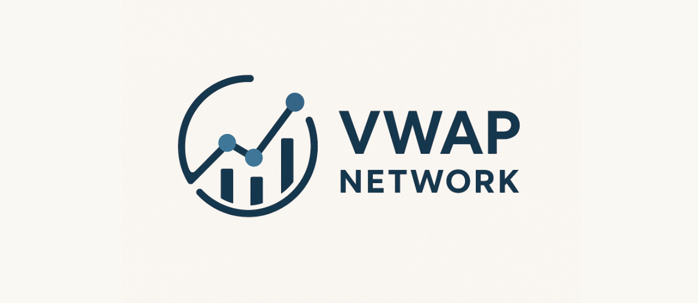

<br>

<p align="center">  
  
</p>


# 🚀 VWAP NETWORK

The **VWAP Network** project aims to provide a **general-purpose framework** for training **MLP/RNN models** on **financial and cryptocurrency data**, along with modules for **data retrieval** and **transformation** — making them directly usable for machine learning workflows.

At the current stage, the project is **not yet functional** — the codebase is experimental and under heavy development. However, over time, it will evolve into a structured and flexible research environment.

---

## 🧩 Current Features

- Unified and simple way to **fetch OHLCV crypto data**  
- Structured **project architecture** for navigating multiple trained models  
- Flexible system for **defining and analyzing custom labels**  
- Flexible **feature creation and analysis** workflow  
- Consistent **data filtering layer** across the project  
- Random **model generator** for efficient hyperparameter search  
- Support for **binary and 3-class model training**  
- **Backtesting module** for model evaluation on OHLCV data  
- Numerous **utility functions** for data analysis and feature engineering  

---

## 🧠 Planned Features

- Full support for **RNN/LSTM/GRU architectures**  
- Unified **data transformation pipeline** between training and backtesting  
- **Indicator-based filter generator** for data preprocessing  
- Better **modular structure** for analytical functions  
- Integration of **macroeconomic event filters**  
- **Vectorization** and optimization of existing label functions 
- Improved **feature I/O system** (reading/writing workflow)
- Optimalisation of tensorflow through better GPU usage.

---

## 🧾 Notes

This repository is a **work in progress** and the code is **basically shit** and **NOT RELIABLE**

The end goal is to create a **clean, reproducible, and extensible framework** for quantitative crypto research and ML-based trading systems.


---

## Examples of usage 

#### 🚀 Fetching OHLCV data

```python
from load_data import fetch_ohlcv_df

df = fetch_ohlcv_df(
    ticker="BTC/USDT",
    interval="1m",
    start_year=2023,
    start_month=1,
    start_day=1
)
print(df.head())
```

#### 🧮 Compute Features and Save to Parquet

```python
from calculations import calc_indicators
from load_data import iterate_over_folder_and_save_features

data_path = "data/1m/training_data"
iterate_over_folder_and_save_features(data_path=data_path, calc_func=calc_indicators, log=True)
```


#### 🧩 Global Label Analysis Across All Tickers

```python
from functools import partial
from pathlib import Path

from labels import calc_label9
from filters import filter_clean, filter_hours, filter_remove_long_series
from load_data import analyze_labels_in_folder

# --- 1️⃣ Define base data path ---
base_path = Path("data/training_data")

# --- 2️⃣ Define filters ---
filters = [
    filter_clean(),
    filter_hours(0, 8),
    filter_remove_long_series(max_len=10, sigma_mult=2.45)
]

# --- 3️⃣ Define label variants ---
label_functions = [
    partial(calc_label9, T=30, alpha=0.60, use_atr=False),
    partial(calc_label9, T=40, alpha=0.65, use_atr=True),
    partial(calc_label9, T=50, alpha=0.70, use_atr=False)
]


for f in label_functions:
    f.__name__ = f"calc_label9_T{f.keywords['T']}_a{f.keywords['alpha']}_atr{int(f.keywords['use_atr'])}"


# --- 4️⃣ Run label analysis across all CSV files ---
all_counts, summary_df = analyze_labels_in_folder(
    base_path=base_path,
    label_functions=label_functions,
    filters=filters,
    sigma_val=2.45
)

# --- 5️⃣ Review global summary ---
print("\n=== 📊 GLOBAL SUMMARY (Top 5 rows) ===")
print(summary_df.head())

```

